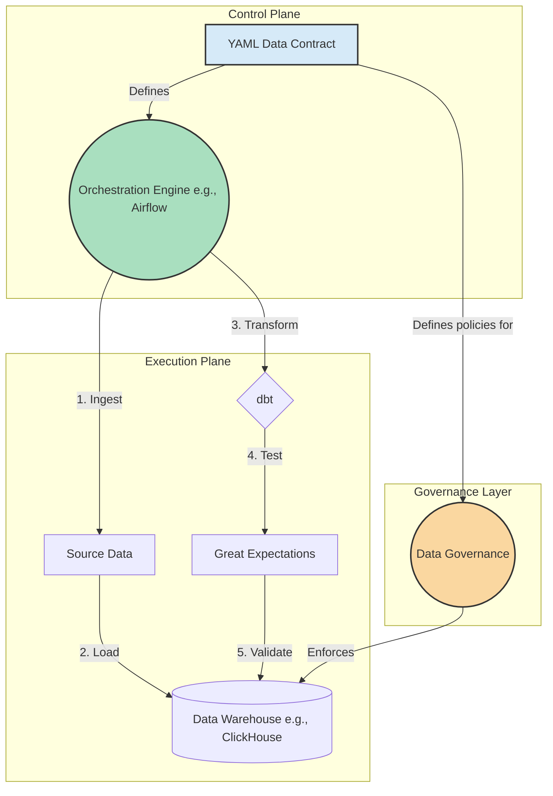

# Declarative ELT Framework (Work in Progress)

This project is a proof-of-concept for a metadata-driven ELT framework. The core idea is to move pipeline definitions from imperative code (like Python) into declarative YAML configuration files. This approach allows for faster onboarding of new data sources, enforces data quality and governance by default, and democratizes data pipeline development.

## Core Concept & Architecture

Instead of writing a new DAG for every data source, this framework uses a single, dynamic orchestrator that reads a YAML file to generate and execute the required tasks. This YAML file acts as a "Data Contract," defining the entire lifecycle of a data asset.

The intended architecture is as follows:

## How It Works

1.  **Define**: An engineer or analyst defines a new data pipeline by creating a simple YAML file. This file specifies the source, destination, the dbt models to run, the Great Expectations quality checks to enforce, and governance metadata like the data owner.

2.  **Orchestrate**: An orchestrator (like Airflow or a custom Python script) reads the YAML file.

3.  **Execute**: The orchestrator dynamically calls the necessary tools to perform the ELT process:
    *   Ingest the data from the source.
    *   Trigger `dbt run` to perform the transformations.
    *   Trigger Great Expectations to validate the resulting data against the rules defined in the YAML contract.

4.  **Govern**: The governance metadata from the YAML is used to apply tags, set access policies, and populate a data catalog.

## Technology Stack

*   **Orchestration**: Python (with a plan to integrate Airflow)
*   **Transformation**: dbt
*   **Data Quality**: Great Expectations
*   **Containerization**: Docker

## Current Status

This project is currently a work in progress. The foundational scripts and the YAML configuration concept have been implemented. The integration with dbt is not yet complete and will be the next area of focus.

## Future Work

*   Complete the dbt and Great Expectations integration.
*   Develop a dynamic Airflow DAG that generates tasks based on the YAML configuration files.
*   Build a simple data governance module to demonstrate PII tagging based on the YAML contract.
